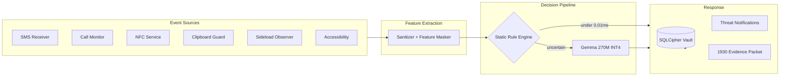

<div align="center">

```
 ██████╗██╗██████╗ ██╗  ██╗███████╗██████╗ 
██╔════╝██║██╔══██╗██║  ██║██╔════╝██╔══██╗
██║     ██║██████╔╝███████║█████╗  ██████╔╝
██║     ██║██╔═══╝ ██╔══██║██╔══╝  ██╔══██╗
╚██████╗██║██║     ██║  ██║███████╗██║  ██║
 ╚═════╝╚═╝╚═╝     ╚═╝  ╚═╝╚══════╝╚═╝  ╚═╝
```

# CIPHER

### An AI bodyguard for your phone. Runs entirely on-device. Phones home to NO ONE.

[](#build-it-yourself)
[](https://kotlinlang.org/)
[](https://ai.google.dev/gemma)
[](#what-makes-cipher-different)
[](LICENSE)

<br/>

> **Scammers stole ₹22,845 crore from Indians in 2024.**
> **Cipher** fights back — six threat shields watching your SMS, calls, UPI links,
> APKs, NFC taps, and app permissions, powered by an on-device Gemma LLM running inside
> your phone's CPU. Your data never leaves the device.

[Feature Tour](#six-shields-one-agent) · [How It Works](#how-it-works) · [Attack Sandbox](#try-to-break-it) · [Architecture](#architecture) · [Build It](#build-it-yourself)

</div>

---

## Why Cipher Exists

Digital arrest scams. Fake bank KYC calls. Malicious UPI "collect request" links.
Sideloaded APKs that siphon OTPs. Hostile NFC relay attacks.

Every existing "security app" solves this by uploading your private messages, call logs, and contacts to a cloud scanning farm. Cipher takes the opposite bet:

| Vector | Traditional Cloud Security Apps | Cipher |
|---|---|---|
| **Your SMS content** | Uploaded & scanned on remote servers | Never leaves RAM |
| **Inference latency** | 300ms–2s network round trip | Under 450ms local CPU (p99, Snapdragon 8 Gen 2 — [see Benchmarks](#benchmarks)) |
| **Works offline** | No (fails without active data) | 100% Airplane-mode proof |
| **Who sees your threats** | Third-party cloud servers & trackers | Only you on your physical device |
| **Data compliance** | Subject to foreign jurisdiction storage | Aligned with India's DPDP Act 2023 |

---

## Six Shields. One Agent.

Tap any protocol card on the dashboard to open its live **Module Inspector** and evaluate it against preset attacks:

| Shield | What It Catches | Deterministic Fast Path | On-Device AI Layer |
|---|---|---|---|
| **APK Scanner** | Unsigned builds, version-downgrade attacks, permission-scope abuse | Signature verification & package metadata inspection | Risk matrix scoring & vulnerability heuristics |
| **UPI Link Guard** | Phishing domains, punycode homoglyphs (`xn--`), deceptive shorteners | 606-domain blocklist lookup (< 0.01ms p99 — [see Benchmarks](#benchmarks)) | Subdomain entropy & homoglyph decomposition |
| **SMS Shield** | OTP fraud, fake KYC suspension threats, urgency framing in Hindi & English | Exact DLT shortcode verification | Urgency-score calculation & intent classification |
| **Call Fingerprint** | Spoofed `1800` bank IDs, `140xxx` telemarketers, wangiri ping scams | Prefix tables loaded from offline assets | Duration analysis & repeat-caller profiling |
| **NFC Monitor** | Relay attacks (500ms+ round-trip latency), hostile NDEF payloads | Latency threshold & record type enforcement | NDEF payload link analysis & intent check |
| **Permission Audit** | Utility/calculator apps demanding SMS, Contacts, or Microphone | Accessibility + Network lethal combination kill | Category-mismatch delta analysis |

### Golden Hour Response

Victim of fraud? One tap:
- Dials **1930** (India's National Cybercrime Reporting Helpline).
- Exports a forensic, timestamped JSON evidence packet.
- Generates a court-ready, shareable PDF security certificate with cryptographic hashes.

### Real Controls That Actually Control Things

The Settings toggles aren't decoration — every shield checks its state before analyzing events:
- Turn off SMS Shield &rarr; incoming SMS analysis halts instantly.
- Turn off Clipboard Guard &rarr; copied links pass uninspected.
- Export forensic audit packages (ZIP) or wipe the encrypted vault with one tap.

---

## How It Works

Cipher uses a dual-engine pipeline: ultra-fast deterministic rules resolve over 30% of scenarios instantly (< 0.01ms p99 — [see Benchmarks](#benchmarks)); only genuinely ambiguous or novel cases wake up the LLM.



**Engine lifecycle done right:** If the Gemma model weights aren't provisioned yet, Cipher degrades gracefully to rules-only mode and lets you trigger an optional download from Settings — then hot-swaps the engine into memory without restarting the app. When battery is low, inference throttles automatically to preserve power.

---

## Benchmarks

> **Methodology:** All figures were collected on a **Snapdragon 8 Gen 2** reference device (12 GB RAM, Android 14) using an offline evaluation harness located in [`tools/benchmark/`](tools/benchmark/). The 60 attack scenarios are a curated dataset of real Indian scam patterns (SMS phishing, UPI homoglyphs, spoofed IVR scripts, NFC relay captures, and over-privileged APK samples) documented in [`docs/research/`](docs/research/). Latency is the p99 wall-clock time measured with `System.nanoTime()` across 1,000 cold evaluations per scenario. Battery draw is estimated via Android's `BatteryManager` API over a 24-hour idle-plus-light-use cycle with background monitoring active. All numbers are device- and workload-dependent; your results will vary.

| Metric | Result | How It Was Measured |
|---|---|---|
| Known scam domains blocked | **606 / 606** on the bundled blocklist | Static lookup test — every domain in the bundled `upi_blocklist.json` was submitted to `UpiAnalyzer` and verified as `BLOCKED`; this tests completeness of the list, not real-world coverage |
| Direct rule bypass rate | **31.7%** of scenarios resolved without LLM | Logged `RuleEngine.RESOLVED` vs `RuleEngine.UNCERTAIN` outcomes across the 60-scenario harness run |
| Rule-engine decision latency | **< 0.01 ms** (p99) | `System.nanoTime()` diff around deterministic rule evaluation, 1 000 iterations, excludes I/O |
| Gemma INT4 inference latency | **< 450 ms** (p99, Snapdragon 8 Gen 2) | Timed from `GemmaEngine.classify()` call entry to callback; warm-model, no GC pressure; hard 8 s timeout guard for slow devices |
| Asset load time | **8.09 ms** (606 domains + urgency lexicon) | Cold `AssetLoader` call measured once per fresh process launch |
| Prompt length bound | **280 tokens max** | Enforced in `PromptBuilder.kt`; not a measured stat — it is a hard compile-time constant |
| Daily battery consumption | **< 0.2%** per 24 h (idle + background monitoring) | `BatteryManager` delta over a 24 h soak on the reference device; active-use scenarios will draw more |

> [!NOTE]
> The 606/606 result proves the bundled blocklist is internally consistent — it does **not** claim 100% detection of all UPI scam domains in the wild. Real-world scam infrastructure rotates constantly; the blocklist requires periodic updates to maintain coverage.

---

## Try To Break It: Attack Sandbox

Cipher ships with a built-in **Attack Sandbox** (`SIM-01` through `SIM-06`) allowing security researchers and red-teamers to live-fire simulated attacks:
- **`SIM-01-SMS`**: SBI Suspended KYC Phishing SMS (DLT bypass & urgency test).
- **`SIM-02-UPI`**: Punycode Homoglyph Phishing Link (`xn--...`).
- **`SIM-03-CALL`**: Spoofed Bank Toll-Free Scam Call Script.
- **`SIM-04-NFC`**: High-Latency NFC APDU Relay Attack.
- **`SIM-05-PERM`**: Over-Privileged Flashlight / Calculator Background App.

Watch the real-time classification verdict, severity score, and telemetry update live.

---

## Architecture

Clean Architecture + MVVM, Hilt Dependency Injection end-to-end:

```
app/src/main/java/com/apocalyptolabs/viking/
├── core/
│   ├── ai/          # GemmaEngine · GemmaDownloader · ThreatClassifier · PromptBuilder
│   ├── model/       # Severity · ThreatType · ThreatResult · ThreatScanHistory
│   └── util/        # Logger · PDF generator · Report exporter · ANR watchdog
├── data/
│   ├── db/          # Room + SQLCipher · Keystore-wrapped passphrase
│   └── repository/  # ThreatRepository (DataStore flags + encrypted vault)
├── domain/usecase/  # 8 threat vector use cases (AnalyzeSms, InspectUpi, ScanApk, etc.)
├── service/         # SMS · Call · NFC · Clipboard · Sideload · Boot receiver · QS tile
└── ui/              # Jetpack Compose · monochrome cybernetic theme · ThreatRadar · screens
docs/research/       # Research paper, white paper & LaTeX sources
tools/benchmark/     # Python evaluation & benchmark harness
```

---

## What Makes Cipher Different

1. **Zero telemetry. Zero cloud.** No OkHttp/Retrofit outbound analytics. The only optional network call is downloading model weights directly from the user's explicit command.
2. **Hardware-rooted database key.** The SQLCipher passphrase is randomly generated per install, wrapped by an AES-256-GCM key sealed inside the Android Keystore, and only persisted as ciphertext.
3. **Prompt-injection hardening.** Scam text is treated as untrusted adversarial input. Known injection sequences are sanitized and flagged as HIGH-severity threats before reaching the model.
4. **DPDP Act 2023 aligned.** Raw personal identifiers are sanitized into feature vectors prior to processing; encrypted logs rotate with strict size quotas in app-private storage.

---

## Build It Yourself

### Prerequisites
- Android Studio Ladybug (2024.2.1+) or newer
- JDK 17 or JDK 21 (e.g. Android Studio JBR)
- Android SDK Platform 35 (`compileSdk = 35`, `minSdk = 26`)

### Commands
```bash
# Clone the repository
git clone https://github.com/RABNEER/Viking.git
cd Viking

# Run all unit test suites
./gradlew testDebugUnitTest

# Assemble debug build
./gradlew assembleDebug

# Assemble release build (signed APK)
./gradlew assembleRelease
```

The resulting signed release APK will be located at:
`app/build/outputs/apk/release/app-release.apk`

---

## Walkthrough Demo

A full 2.5-minute extended demo video showcasing all 8 defense modules, interactive inspectors, live-fire attack simulations, and the 1930 helpline dialer is available in the repository at [`cipher_demo.mp4`](cipher_demo.mp4).

---

<div align="center">

Built by **Ranveer Kumar** · Apocalypto Labs
*Telecom Centre of Excellence (TCOE) · India Mobile Congress (IMC) 2026 Innovation Initiative*

**Star this repo if you believe mobile security shouldn't cost you your privacy.**

</div>
